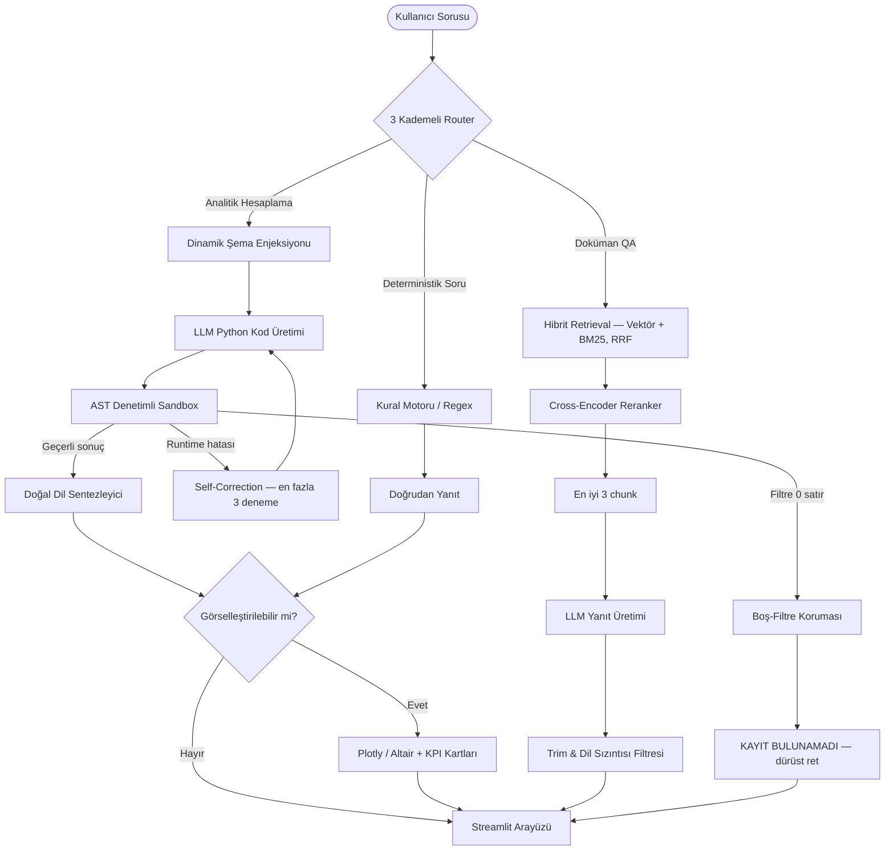

# Yerel Hibrit RAG ve Analitik Soru-Cevap Sistemi
## Kapsamlı Teknik Rapor — v6

| | |
| :--- | :--- |
| **Proje** | Yerel Hibrit RAG + Dinamik Kod Yorumlayıcı (Text-to-Pandas) + Analitik Görselleştirme |
| **Aktif Sürüm** | **v6** — Sandbox Boş-Filtre Koruması & Soru Bağlamlı Ret Skorlayıcı |
| **Tarih** | Eylül 2026 |
| **Platform** | Windows 10/11 · Python 3.10+ · CUDA (8 GB VRAM) · %100 yerel çalışma |
| **Üretim Modeli** | Qwen 2.5 7B (Foundry Local) · Embedding: `bge-m3` · Reranker: `bge-reranker-v2-m3` |
| **Kanıt Dizini** | `experiments/v6_sandbox_empty_guard/` · Deney kaydı: `docs/EXPERIMENTS.md` |

---

## 0. Bu Rapor Nasıl Okunmalı — İki Ölçüm Tabanı

Raporda **iki farklı soru kümesi** üzerinden rakam verilir. Karıştırılmamaları
kritiktir; her tablonun başlığında hangisi olduğu belirtilmiştir.

| Taban | Kapsam | Nerede kullanılır | Neden |
| :--- | :--- | :--- | :--- |
| **132 soruluk tam koşu** | `test_1..test_4` + `test_negative`'in tamamı | §1, §5 — sistemin **mutlak** performansı | v6 koşusunda hiçbir soru altyapı hatası vermedi; sistemin gerçek karnesi budur. |
| **98 soruluk temiz set** | `test_2#43` ve `test_2#53` çıkarılmış pozitif setler | §4 — **sürümler arası** karşılaştırma | Bu iki soru her deneyde kronik GPU bellek hatası verdi; adil kıyas için iki taraftan da çıkarılır. |
| **31 soruluk negatif kıyas** | `test_negative` eksi `#216` | §4'ün "Negatif FP" sütunu | v5 koşusunda `#216` altyapı hatası verdi, v6'da vermedi. v6'nın **kendi tam sayısı 2/32**'dir. |

> **Sonuç:** §4'teki `F1 = 40.0` ile §5'teki `F1 = %52.43` çelişmez — biri 98
> soruluk pozitif set, diğeri negatif setin de dahil olduğu 132 soruluk tam
> koşudur. Negatif sorularda doğru ret tam puan aldığı için tam koşunun
> ortalaması yapısal olarak yüksektir.

**Metrik uyarısı:** Negatif sette raporlanan `F1 / ROUGE-L / Semantik = %93.75`
bir *metin benzerliği* değil, **ret doğruluğu vekilidir** (30/32 doğru ret).
Aynı şekilde negatif setin `Retrieval = %100` değeri trivialdir: cevaplanacak bir
hedef chunk yoktur.

---

## 1. Yönetici Özeti

Bu proje; kurumsal ve akademik dokümanlar (PDF, DOCX, TXT) ile yapılandırılmış
veri setleri (JSON, CSV) üzerinde çalışan, **%100 yerel (on-premise)**, sıfır veri
sızıntılı ve halüsinasyon korumalı bir hibrit soru-cevap ve veri analitiği
asistanıdır.

Klasik RAG mimarilerinin çözemediği **sayısal hesaplama, oran bulma, çoklu
filtreleme ve görselleştirme** ihtiyaçları için sistem dört ayırt edici bileşenle
donatılmıştır:

1. **3 Kademeli Akıllı Yönlendirici** — her soruyu en ucuz doğru rotaya gönderir.
2. **AST Denetimli Güvenli Sandbox** — LLM'in ürettiği Python'u izole çalıştırır.
3. **Boş-Filtre Koruması** — v6'nın ana katkısı; "hiç eşleşmeyen sorgu"yu olgu
   gibi sunmayı yapısal olarak imkânsız kılar.
4. **Etkileşimli Görselleştirme Motoru** — analitik sonucu grafiğe ve KPI'ya çevirir.

### Temel Başarı Göstergeleri (v6 — 132 soruluk tam koşu)

| Gösterge | Değer | Not |
| :--- | :---: | :--- |
| **Genel Karar Doğruluğu** | **%88.64** | 117 / 132 |
| **Halüsinasyon (FP) Oranı** | **%1.52** | 2 / 132 — negatif tuzaklarda 7'den 2'ye |
| Hatalı Ret (FN) Oranı | %9.85 | 13 / 132 — prompt yumuşatmasıyla 23'ten 13'e |
| Retrieval Doğruluğu (Top-3) | %97.73 | MRR %97.0 |
| Semantik Benzerlik | %80.83 | |
| Token-Level F1 | %52.43 | ROUGE-L %49.07 · EM %27.27 |
| Ortalama / Medyan Yanıt Süresi | 30.55 sn / 21.05 sn | Yerel 8 GB VRAM |

### v6'nın Tek Cümlelik Katkısı

> Negatif set halüsinasyonlarının **6/7'si** tek bir mekanizmadan geliyordu:
> var olmayan bir varlık için kurulan Pandas maskesi 0 satır döndürüyor,
> üstündeki `.sum()` / `.mean()` bundan sessizce `0` / `NaN` üretiyor ve
> sentezleyici bunu olgu gibi sunuyordu — *"ACC-124 hesabının kapanış bakiyesi
> 0'dır"*. v6 bu sınıfı **sonucun değerine değil, filtrenin eşleşip
> eşleşmediğine** bakarak kapattı: FP **7 → 2**, pozitif set metrikleri **birebir
> değişmeden** (98 cevabın 98'i karakter karakter özdeş).

---

## 2. Uçtan Uca Sistem Mimarisi



**Tasarım ilkesi:** Her rota kendi doğruluk garantisini kendi katmanında verir —
sandbox rotasında *filtre eşleşmesi*, RAG rotasında *reranker skoru*, kural
motorunda *deterministik eşleşme*. Hiçbir rota bir diğerinin hatasını maskelemez.

---

## 3. Sistem Bileşenleri

### 3.1 İndeksleme ve Veri Hazırlığı — `src/ingest.py`

| Konu | Uygulama |
| :--- | :--- |
| PDF | `pdfplumber` ile sayfa bazlı çıkarım, çift satırbaşı sınırında chunk'lama |
| DOCX | `python-docx` ile paragraf hiyerarşisi tabanlı chunk'lama |
| TXT / Markdown | Paragraf ve semantik sınır odaklı parçalama |
| Depolama | `sqlite3` / `rag.db`, WAL modu, otomatik şema migrasyonu, dosya bazlı transaksiyon |
| İdempotanlık | Aynı dosyanın yeniden indekslenmesi mükerrer chunk üretmez |
| Chunk sınırı | `MAX_CHUNK_CHARS = 1500` — ölçümle belirlendi (bkz. §4.2) |

### 3.2 Embedding ve Yeniden Sıralama — `src/embedder.py`, `src/retrieval.py`

* **Dense:** `BAAI/bge-m3`, 1024 boyutlu çok dilli vektör, batch = 16.
* **Sparse:** BM25 — kod, kısaltma ve özel isim eşleşmelerini yakalar.
* **Füzyon:** Reciprocal Rank Fusion (RRF) ile iki listenin birleştirilmesi.
* **Rerank:** `BAAI/bge-reranker-v2-m3` cross-encoder; 16 adaydan **en iyi 3**
  (`RERANK_TOP_N = 3`).

> Aday havuzunu 64'e, seçilen chunk sayısını 8'e çıkarmak **oracle yakalama
> oranını artırmadı**, yalnızca bağlam kirliliği üretti (§4.2).

### 3.3 3 Kademeli Yönlendirici — `src/router.py`

| Kademe | Tetikleyici | Tipik gecikme |
| :--- | :--- | :--- |
| 1 — `rule_engine` | Basit sayım / şablon soruları | milisaniye |
| 2 — `code_interpreter` | Sektör, şehir, tarih, ortalama, oran, çoklu filtre | 20–70 sn |
| 3 — `semantic_rag` | Kavramsal, tanımsal, doküman içi metin | 15–45 sn |

Ayrıca **görsel istek tespiti** (dağılım, grafik, pasta/çubuk) görselleştirme
hattını tetikler.

### 3.4 Güvenli Sandbox ve Boş-Filtre Koruması — `src/sandbox.py`

**AST statik analizi.** Kod çalıştırılmadan önce AST düzeyinde taranır;
`import`, `open`, `eval`, `exec`, `os`, `sys`, `subprocess`, socket erişimleri ve
dunder (`__`) öznitelikleri **derleme anında** reddedilir.

**İzolasyon.** Kod daima `df.copy()` üzerinde çalışır; sonsuz döngülere karşı
5 saniye limitli daemon thread zaman aşımı devrededir.

**`TrackedDataFrame` — v6'nın çekirdeği.** Boolean maske 0 satır döndürdüğünde
thread-local bir bayrak kalkar. `code_interpreter.is_no_match_result` bu bayrağı
(veya yapısal boşluğu) görünce sonucu "kayıt bulunamadı" işaretler; `data_engine`
bu durumda `result_to_natural_language`'i **hiç çağırmaz** — sayıyı cümleye
çeviren adım tam olarak orasıydı — ve `retrieval` normal `[KESİN HESAPLAMA
SONUCU]` yerine `[KAYIT BULUNAMADI]` bloğunu geçirir.

> **Neden değer kontrolü yetmez:** `#225`'in sonucu
> `{'total_amount': 0.0, 'currency': 'USD'}` idi — yapısal olarak **boş değil**.
> Bu vakayı yalnızca maske takibi yakalar. Simetrik olarak *meşru sıfır* (hesap
> var, net bakiye gerçekten 0) maske eşleştiği için normal sonuç kalır. Bu ayrım
> `tests/test_empty_result_guard.py` ile kilitlenmiştir.

### 3.5 Kod Yorumlayıcı ve Self-Correction — `src/code_interpreter.py`

* **Dinamik şema enjeksiyonu:** Sütun adları, `dtypes` ve ilk 2 örnek satır sistem
  prompt'una eklenir — hayali sütun uydurmayı engeller.
* **Retry döngüsü:** Runtime hatasında traceback modele geri verilir; **en fazla
  3 deneme**.
* **`result_to_natural_language`:** Scalar / Series / dict / DataFrame çıktısını
  veriyi tahrif etmeden Türkçe yanıta çevirir.

### 3.6 Görselleştirme Motoru — `src/visualizer.py`

`extract_chart_data` gelen tabüler veriden kategori ve metrikleri otomatik
çıkarır; Plotly ve Altair ile etkileşimli çubuk, yatay çubuk ve donut grafikleri
üretilir (`#8b5cf6`, `#60a5fa`, `#34d399` paleti). KPI kartları toplam, maksimum,
ortalama ve kategori adedini özetler.

### 3.7 Arayüz ve Stil Sistemi — `src/app.py`, `src/components.py`, `src/styles.py`

WCAG AA uyumlu koyu tema (`#0f0c29` / `#302b63` / `#24243e` zeminleri; 4.5:1 ve
10:1 kontrast). Glassmorphism sohbet balonları, alaka skoru rozetleri, dosya türü
ikonları, açılır kaynak kartları ve çalıştırılan Python kodunun görüntüleyicisi.

---

## 4. Deneysel İterasyonlar

### 4.1 Sürüm Karşılaştırması

*(98 soruluk temiz pozitif set; "Negatif FP" sütunu v5–v6 için n=31)*

| Sürüm | FN ↓ | F1 ↑ | ROUGE-L ↑ | Semantik ↑ | Negatif FP ↓ | Karar |
| :--- | :---: | :---: | :---: | :---: | :---: | :--- |
| v2 — Baseline + trim düzeltmesi | 23 | 39.6 | **36.6** | 73.9 | 7 / 32 | Superseded |
| v3 — Yumuşatma + chunk büyütme | **10** | 32.1 | 27.9 | 75.6 | 8 / 32 | ❌ Alınmadı |
| v4 — Başarısız koşu | — | — | — | — | — | ⚠️ Geçersiz |
| v5 — Yumuşatma + kısalık kısıtı | 13 | **40.0** | 35.5 | **77.5** | 7 / 31 | Superseded |
| **v6 — Sandbox boş-filtre koruması** | **13** | **40.0** | **35.5** | **77.5** | **2 / 31** | ✅ **Aktif** |

**v3 neden alınmadı (üç bağımsız sebep):** cevap uzunluğu medyan 19 → 48 kelimeye
çıkınca token-F1 39.6 → 32.1 geriledi; negatif FP 7 → 8 arttı (yeni FP tam olarak
"yanlış ön kabul" kategorisinde); bağlam ~8700 karaktere çıkınca Foundry Local
8 GB VRAM'de çöktü (`test_2`'de 30 sorunun 8'i "Connection error").

**v4 neden geçersiz:** Foundry servisi koşu sırasında üç kez çöktü; skorlayıcı
hata satırlarını ret olarak tanımadığı için bunları **TP saydı** ve metrikleri
yapay olarak iyi gösterdi. Bu rakamlar kullanılmamalıdır.

**v6'da iki etkinin ayrımı.** Bu deneyde `check_is_not_found` skorlayıcısı da
değişti; karşılaştırmanın geçerli olması için v5'in negatif koşusu **yeni
skorlayıcıyla yeniden skorlandı**:

| | Eski skorlayıcı | Yeni skorlayıcı |
| :--- | :---: | :---: |
| v5 negatif FP (n=31) | 7 | 6 |
| v6 negatif FP (n=31) | 2 | 2 |

Yani **7 → 6 düşüşü yalnızca skorlayıcıdan** (`#231`), **6 → 2 düşüşü yalnızca
kod düzeltmesinden** gelir. Kazanç bir ölçüm artefaktı değildir.

### 4.2 Denenip Çürütülen Hipotezler

1. **`MAX_CHUNK_CHARS` 1500 → 2900.** Bağlam ~8700 karaktere çıkınca 8 GB VRAM
   sınırında çökme. Ölçülen kazanç marjinaldi (6 sondajdan 1'i). **Geri alındı.**
2. **Chunk sayısı 3 → 8, aday havuzu 16 → 64.** Oracle chunk yakalama oranı
   artmadı; bağlam kirliliği arttı. **Geri alındı.**
3. **Sonucun değerine bakarak boş sonuç tespiti.** `0` / `NaN` kontrolü hem
   `#225` gibi yapısal olarak dolu vakaları kaçırıyor hem de meşru sıfırları
   yanlışlıkla reddediyordu. **Filtre-eşleşme takibiyle değiştirildi.**

---

## 5. Test ve Benchmark Değerlendirmesi

### 5.1 Test Veri Seti (Toplam 132 Soru)

| Set | Soru | İçerik |
| :--- | :---: | :--- |
| `test_1` | 30 | PDF / DOCX üzerinden temel metin QA |
| `test_2` | 30 | `728_profiles.json`, `airports.json` — aggregation ve filtreleme |
| `test_3` | 30 | Karmaşık teknik terimler, matematiksel dönüşüm, çoklu doküman |
| `test_4` | 10 | Özel formatlı dokümanlar, çeviri / yabancı dil |
| `test_negative` | 32 | 4 tuzak kategorisi: hayali varlık, yanlış ön kabul, gelecek tarih, alan dışı |

### 5.2 Karar Matrisi *(132 soruluk tam koşu)*

```
                            SİSTEM KARAR MATRİSİ (132 SORU)
  ┌────────────────────────────────────────┬────────────────────────────────────────┐
  │         GERÇEKTE VAR (POZİTİF)         │        GERÇEKTE YOK (NEGATİF)          │
  ├────────────────────────────────────────┼────────────────────────────────────────┤
  │   Doğru Pozitif (TP): 87  (%65.91)     │   Yanlış Pozitif (FP):  2  (%1.52)     │
  │   [Doğru cevap üretildi]               │   [Halüsinasyon / tuzağa düşüldü]      │
  ├────────────────────────────────────────┼────────────────────────────────────────┤
  │   Yanlış Negatif (FN): 13  (%9.85)     │   Doğru Negatif (TN): 30  (%22.73)     │
  │   [Cevap üretilemedi, ret verildi]     │   [Başarıyla reddedildi]               │
  └────────────────────────────────────────┴────────────────────────────────────────┘

  Karar Doğruluğu = (TP + TN) / 132 = 117 / 132 = %88.64
```

### 5.3 Zorluk Seviyesine Göre Dağılım *(132 soruluk tam koşu)*

| Kategori | Soru | EM (%) | F1 (%) | Semantik (%) | Retrieval (%) | Ort. Süre (sn) |
| :--- | :---: | :---: | :---: | :---: | :---: | :---: |
| Kolay | 22 | 18.18 | **47.54** | **80.18** | 100.0 | 30.10 |
| Orta | 58 | 3.45 | **42.15** | **78.03** | 96.55 | 29.53 |
| Zor | 20 | 0.00 | **21.49** | **68.99** | 95.00 | 51.33 |
| Negatif † | 32 | 93.75 | 93.75 | 93.75 | — | 19.70 |

† Negatif satırın tüm metrikleri **ret doğruluğu vekilidir** (30/32), metin
benzerliği değildir; retrieval değeri anlamsızdır (hedef chunk yoktur).

**Okuma:** Zorluk arttıkça F1 keskin (47.5 → 21.5), semantik benzerlik ise ılımlı
(80.2 → 69.0) düşer. Bu, zor sorularda sistemin **yanlış cevap vermediğini,
doğru cevabı farklı kelimelerle ve daha uzun ifade ettiğini** gösterir — token
örtüşmesi cezalanır, anlam korunur. Zor sorulardaki 51.33 sn'lik ortalama süre
self-correction retry zincirlerinden gelir (tekil maksimum 188.3 sn).

### 5.4 Test Seti Bazında Sonuçlar *(132 soruluk tam koşu)*

| Set | Soru | TP | TN | FP | FN | F1 (%) | Semantik (%) | Retrieval (%) | Medyan (sn) |
| :--- | :---: | :---: | :---: | :---: | :---: | :---: | :---: | :---: | :---: |
| `test_1` — Temel QA | 30 | 27 | 0 | 0 | 3 | **55.61** | **81.71** | 100.0 | 15.28 |
| `test_2` — JSON analitiği | 30 | 26 | 0 | 0 | 4 | 29.10 | 74.15 | 93.33 | 38.70 |
| `test_3` — Karmaşık QA | 30 | 27 | 0 | 0 | 3 | 38.61 | 76.88 | 96.67 | 42.96 |
| `test_4` — Özel dokümanlar | 10 | 7 | 0 | 0 | 3 | 22.11 | 68.73 | 100.0 | 38.09 |
| `test_negative` — Tuzak | 32 | 0 | **30** | **2** | 0 | 93.75 † | 93.75 † | — | 16.55 |

`test_2`'nin düşük F1'i (29.10) beklenendir: sandbox rotası sayısal sonucu tam
cümleye çevirir, referans cevap ise çıplak sayıdır — token örtüşmesi yapısal
olarak düşük kalır. Aynı sette semantik benzerliğin %74'te kalması ve FP'nin
**0** olması, sonucun doğru ama ifadenin uzun olduğunu doğrular.

### 5.5 Kalan Hataların Analizi

**13 Yanlış Negatif.** Skorlayıcının otomatik kırılımı bunların **12'sinde doğru
kaynağın Top-3'e girdiğini** ("doğru kaynak ama cevap yok"), yalnızca 1 vakada
retrieval'ın ıskaladığını raporlar (`test_3`). Manuel incelemede baskın kök neden
**zamir / koreferans kopukluğu**dur: hedef paragraf doğru belgeden gelir, ancak
soruyu bağlayan özel isim o paragrafta hiç geçmediği için model paragrafı
cevapla ilişkilendiremez.

> *Örnek — `test_4#91`:* Soru "Alis kütüphanenin adını nereden öğrendi?"
> Cevabın bulunduğu paragrafta "Alis" kelimesi hiç geçmez; özne zamirle
> taşınmıştır. Dense arama hedef paragrafı üst sıralara çıkaramaz.

**2 Yanlış Pozitif.** İkisi de v6'nın kapattığı sınıfın **dışındadır**:

| ID | Sınıf | Açıklama |
| :--- | :--- | :--- |
| `#224` | Yanlış ön kabul | Sandbox dışı, saf metin rotası. Soru var olmayan bir doküman içeriğini varsayıyor; model ön kabulü sorgulamadan cevaplıyor. |
| `#232` | Yanlış sütun okuma | Sandbox rotası ama **boş filtre değil**: `founded.idxmax()` ile yanlış sütun okunuyor. Ayrı bir hata sınıfı; boş-filtre koruması bu vakayı tasarım gereği yakalamaz. |

---

## 6. Altyapı ve Kararlılık Notları

* **GPU VRAM tavanı.** Qwen 2.5 7B, 8 GB VRAM'de çalışırken uzun retry zincirleri
  veya 8000+ karakterlik bağlamlar taşmaya yol açabilir. Chunk ve bağlam sınırları
  bu tavana göre kalibre edilmiştir (`docs/INFRASTRUCTURE_NOTES.md`).
* **Segmentli koşu zorunluluğu.** Negatif set tek geçişte koşulduğunda `#215 → #216`
  sırası Foundry servisini **deterministik olarak** düşürüyor. v6 negatif koşusu bu
  nedenle iki segmentte (`201–215`, `216–232`) ayrı oturumlarda yürütülmüştür.
* **Dinamik port keşfi.** Foundry Local'in yeniden başlatmalarda değişen TCP portu
  `psutil` süreç taramasıyla otomatik bulunur.
* **Kronik hatalı sorular.** `test_2#43` ve `test_2#53` her deneyde GPU bellek
  hatası verdiği için sürüm karşılaştırmalarından çıkarılır (§0).

### 6.1 Tekrarlanabilirlik

Koşu, `run_tests.py`'nin **kendi** fonksiyonları (`run_single_test`,
`free_gpu_memory`) değiştirilmeden import edilerek yapılmıştır; tek fark her
satırın anında diske yazılması ve id aralığı filtresidir — **RAG davranışı
değişmemiştir.** Ham çıktılar, loglar ve skorlanmış CSV'ler
`experiments/v6_sandbox_empty_guard/{results,report}/` altındadır; koşu koşulları
aynı klasördeki `PROVENANCE.md`'de kayıtlıdır.

---

## 7. Yol Haritası

| Öncelik | İyileştirme | Hedeflenen hata |
| :---: | :--- | :--- |
| 1 | **Koreferans çözümü + parent-child chunking** — chunk'a belge içi üst bağlamı iliştir | 13 FN'in baskın kısmı (§5.5) |
| 2 | **Ön kabul denetimi** — sorudaki varsayımı bağlama karşı doğrulayan ayrı kontrol | `#224` sınıfı FP |
| 3 | **Sütun seçim doğrulaması** — üretilen kodun okuduğu sütunu soru semantiğiyle eşleştirme | `#232` sınıfı FP |
| 4 | **FAISS / HNSW indeksi** — SQLite lineer taramasından geçiş | >100.000 chunk'ta ölçekleme |
| 5 | **Çok turlu sohbet hafızası** — önceki analiz sonuçlarını ve grafik durumunu koruma | Kullanıcı deneyimi |

---

## 8. Sonuç

Sistem, tamamen yerel donanımda ve dışa veri çıkarmadan çalışarak hem serbest
metin dokümanlarını hem de yapılandırılmış tabloları işleyebilmekte, dinamik kod
üretimiyle analitik sorguları hesaplayıp görselleştirmekte ve **%88.64 karar
doğruluğu** ile **%1.52 halüsinasyon oranına** ulaşmaktadır.

v6'nın asıl kazanımı bir metrik artışı değil, **bir hata sınıfının yapısal olarak
kapatılmasıdır:** boş filtre artık olgu gibi sunulamaz ve bu, pozitif set
performansından hiçbir şey götürmeden (98 cevabın 98'i özdeş) sağlanmıştır.
Kalan iki halüsinasyon farklı ve daha dar iki mekanizmadan gelir; her ikisi de
§7'de adreslenmiştir.
