# RAG Pipeline Bellek Optimizasyonu — Walkthrough & Öneri Raporu

## Yapılan Değişiklikler

### 1. Reranker → CPU + Lazy-Load + Auto-Cleanup
**Dosya:** [`embedder.py`](file:///c:/Users/merve/Desktop/rag_project/src/embedder.py)

| Önceki Davranış | Yeni Davranış |
|---|---|
| `_reranker_cache` dict'inde modül ömrü boyunca GPU'da tutuluyordu | Her çağrıda CPU'ya yüklenir, `finally` bloğunda `model = None + gc.collect() + torch.cuda.empty_cache()` ile temizlenir |
| `sentence_transformers` modül başında import ediliyordu | Fonksiyon içinde lazy import — import edilmeden RAM'e yüklenmez |
| Tüm adaylar tek seferde `model.predict()` ile işleniyordu | `batch_size=4` ile parçalı işleme — tepe bellek kullanımı düşer |

**Bellek etkisi:** ~1-2 GB VRAM sürekli → 0 GB VRAM (sadece rerank anında ~500 MB RAM, hemen temizlenir)

---

### 2. Ollama `keep_alive` Ayarı
**Dosya:** [`embedder.py`](file:///c:/Users/merve/Desktop/rag_project/src/embedder.py)

| Parametre | Önceki | Yeni |
|---|---|---|
| `keep_alive` | `"5m"` (varsayılan) | `"0"` (hemen unload) |

- `get_embedding()` ve `get_embeddings()` fonksiyonlarına `keep_alive=OLLAMA_KEEP_ALIVE` eklendi
- İngest sırasında batch'ler art arda gittiğinden model zaten sıcak kalır
- Sorgu zamanında ~2-3 sn ek yükleme maliyeti getirir ama 16GB RAM'de bellek tasarrufu kritik

**Bellek etkisi:** ~2-3 GB (5 dk boyunca) → 0 GB (çağrı bitince anında serbest)

> [!TIP]
> İleride sorgu frekansı artarsa `OLLAMA_KEEP_ALIVE = "30s"` yaparak yükleme maliyetini azaltabilirsiniz.

---

### 3. Foundry Local TTL & Unload
**Dosya:** [`llm_client.py`](file:///c:/Users/merve/Desktop/rag_project/src/llm_client.py)

- `FOUNDRY_MODEL_TTL = 120` (2 dakika idle timeout)
- `load_model()` artık `/openai/load/{name}?unload=true&ttl=120` ile modeli yüklüyor
- Yeni `unload_model()` fonksiyonu — manuel VRAM serbest bırakma (örn. ingest öncesi)

**Bellek etkisi:** LLM 2 dakika boşta kalırsa otomatik unload olur.

> [!NOTE]
> **ÖLÇÜLEREK DOĞRULANDI** (`FOUNDRY_MODEL_TTL=120`, model
> `qwen2.5-7b-instruct-cuda-gpu:4`, `CUDAExecutionProvider` / GPU):
>
> | An | `/openai/loadedmodels` | Servis RSS |
> |---|---|---:|
> | Yükleme öncesi | `[]` | 254 MB |
> | `load_model()` sonrası (28,5 s) | `['qwen2.5-7b-instruct-cuda-gpu:4']` | 613 MB |
> | Inference sonrası, idle 20–124 s | hâlâ yüklü | 1.077 MB |
> | **idle 145 s** | **`[]` ← UNLOAD** | **814 MB** |
>
> Model, TTL eşiğinden (120 s) sonraki ilk poll'da listeden düştü — yani
> TTL unload'u **gerçekten tetikliyor**. Gerçek unload anı 124–145 s
> aralığındadır; 145 s rakamı 20 s'lik poll aralığının çözünürlüğüdür.
>
> Host RSS'inin yalnızca ~263 MB düşmesi beklenen davranıştır: model GPU'ya
> (CUDAExecutionProvider) yüklendiği için ağırlıklar host RAM'inde değil
> **VRAM'de** durur. Serbest kalan VRAM Python tarafından ölçülemez — bu
> süreçte CUDA context yoktur, `torch` CPU-only build'dir.

---

### 4. Bellek Profiling Modülü
**Dosya:** [`memory_profiler.py`](file:///c:/Users/merve/Desktop/rag_project/src/memory_profiler.py) *(YENİ)*

- `MemoryProfiler` sınıfı — `with profiler.measure("step")` context manager
- `snapshot()` — anlık RAM + VRAM + sistem bellek durumu
- `@profile_step("name")` — tek seferlik dekoratör
- `print_report()` — tablo formatında özet (tepe RAM, tepe VRAM, adım bazlı delta)

**Kullanım:** `retrieve()` fonksiyonunda `debug=True` ile çağrıldığında terminalde otomatik çalışır.

---

### 5. Retrieval Profiling Entegrasyonu
**Dosya:** [`retrieval.py`](file:///c:/Users/merve/Desktop/rag_project/src/retrieval.py)

- `debug=True` modunda embedding ve reranking adımları `MemoryProfiler` ile sarmalandı
- Pipeline sonunda otomatik bellek raporu yazdırılır

---

## Model Yaşam Döngüsü — Öncesi vs. Sonrası

```mermaid
gantt
    title Önceki Durum (16GB RAM Darboğazı)
    dateFormat X
    axisFormat %s
    section Embedding (bge-m3)
    Bellekte (5 dk)  :a1, 0, 300
    section Reranker (bge-reranker)
    Bellekte (sonsuza kadar)  :a2, 0, 600
    section LLM (qwen2.5-7b)
    Bellekte (sonsuza kadar)  :a3, 0, 600
```

```mermaid
gantt
    title Yeni Durum (Optimizasyonlar Sonrası)
    dateFormat X
    axisFormat %s
    section Embedding
    Yükle+Çalış+Unload :a1, 0, 5
    section Reranker
    Yükle+Çalış+Temizle :a2, 5, 8
    section LLM
    Yükle+Çalış :a3, 8, 20
    İdle (TTL 120s) :a4, 20, 140
```





## 16GB RAM'de Stabil Çalışma Önerisi

### Eşzamanlı Kalabilecek Modeller
- **Hiçbiri aynı anda bellekte kalmamalı.** 16GB RAM'de 3 modelin aynı anda yüklü olması ~9-13 GB tutar ve sistem süreçlerine/OS'a yer kalmaz.

### Önerilen Sıralı (Sequential) Mimari

| Adım | Model | Cihaz | Bellekte Kalma Süresi |
|------|-------|-------|----------------------|
| 1. Embedding | bge-m3 (Ollama) | Ollama'nın kararı | `keep_alive="0"` — çağrı bitince unload |
| 2. Hibrit Skorlama | Yok (numpy) | CPU | Anlık |
| 3. Reranking | bge-reranker-v2-m3 | **CPU** | Çağrı süresince → `model = None + gc.collect()` |
| 4. LLM Inference | qwen2.5-7b | **GPU (CUDA)** | `TTL=120s` — 2 dk idle sonrası unload |

### Tepe Bellek Profili (ÖLÇÜLMÜŞ — tahmin değil)

Baseline: süreç RSS 19,7 MB · ollama servisleri 126,3 MB. Aşağıdaki tüm
değerler bu baseline'a göre **artıştır**.

| Adım | ΔSüreç RSS | ΔServisler (ollama.exe) | ΔVRAM |
|------|-----------:|------------------------:|------:|
| `import retrieval` | +87,3 MB | +0,0 MB | 0 |
| Embedding (bge-m3) | +87,7 MB | +14,8 MB | 0 |
| Reranker yükle+çalış | +430,0 MB | +14,8 MB | 0 |
| Tam `retrieve()` | +443,3 MB | +5,2 MB | 0 |
| **Ölçülen tepe** | **+443,3 MB** | — | **0** |

**Tepe TOPLAM pipeline maliyeti: ~449 MB** (süreç + yardımcı servisler).

Süreç RSS'inin dökümü:

| Bileşen | Maliyet | Not |
|---|---:|---|
| `import torch` | ~176 MB | tek seferlik, süreç ömrü boyunca kalır |
| `import sentence_transformers` | ~155 MB | tek seferlik |
| Reranker ağırlıkları + çalışma | ~64 MB | ardışık 3 çağrıda sabit → **sızıntı yok** |
| numpy embedding matrisi (916×1024) | ~13 MB | cache'li |

> [!IMPORTANT]
> **VRAM kullanımı sıfırdır.** Kurulu torch CPU-only bir build'dir
> (`2.11.0+cpu`, `torch.cuda.is_available() == False`). Bu süreçte hiçbir
> CUDA context açılmaz; dolayısıyla "duplicate CUDA context" maliyeti de
> yoktur. Yukarıdaki ~8 GB VRAM beklentisi Foundry Local'in **kendi ayrı
> sürecine** aittir ve Python tarafından ölçülemez.

> [!NOTE]
> Embedding (bge-m3) ve LLM (qwen2.5-7b) modelleri bu Python sürecinde
> **değil**, ollama.exe ve Foundry Local süreçlerinde yaşar. Bu yüzden
> `MemoryProfiler` yardımcı süreçlerin RSS'ini ayrı bir sütun olarak ölçer.
> Ölçüm sırasında `ollama ps` her embedding adımından sonra boş döndü →
> `keep_alive="0"` unload'u **doğrulandı**.

### Ek Öneriler

1. **İngest sırasında LLM'i unload edin:**
   ```python
   from src.llm_client import unload_model
   unload_model()  # İngest öncesi VRAM'i boşalt
   # ... ingest işlemi ...
   ```

2. **Profiling ile darboğaz tespiti:**
   ```python
   chunks = get_top_chunks(query, debug=True)
   # Terminal çıktısında bellek raporu görünür
   ```

3. **`OLLAMA_KEEP_ALIVE` ortam değişkeni:** Tüm Ollama modelleri için global ayar yapmak isterseniz:
   ```bash
   set OLLAMA_KEEP_ALIVE=0
   ```

## Test Sonuçları

| Test | Sonuç |
|------|-------|
| `memory_profiler` import | ✅ `snapshot()` çalışıyor, RAM ölçüm doğru |
| `embedder` import | ✅ `KEEP_ALIVE=0`, `RERANKER_DEVICE=cpu` |
| `llm_client` import | ✅ `TTL=120`, `unload_model()` erişilebilir |
| Foundry TTL unload | ✅ Ölçüldü — model 120 s boşta kaldıktan sonra unload oldu (`loadedmodels` → `[]`, servis RSS 1.077 → 814 MB) |
| Sistem RAM snapshot | 11,283 / 15,655 MB (%72) — ⚠️ **bu rakam pipeline'ın maliyeti DEĞİLDİR** |

> [!WARNING]
> **Yaygın yanlış okuma:** Yukarıdaki 11 GB, `psutil.virtual_memory().used`
> değeridir; yani OS + tarayıcı + IDE dahil **tüm makinenin** kullanımıdır.
> Ölçüm anında boş bir Python süreci yalnızca ~17 MB RSS kaplarken sistem
> 12,6 GB gösteriyordu — aradaki fark tamamen pipeline dışıdır.
> Pipeline'ın gerçek maliyeti için `MemoryProfiler`'ın **baseline'a göre delta**
> raporuna bakın: `ΔSüreç RSS` (bu Python süreci) + `ΔServisler`
> (ollama.exe / Foundry Local — modeller **ayrı süreçlerde** durur, bizim
> RSS'imize hiç yansımaz). `Sistem geneli` satırı yalnızca "makinede yer kaldı
> mı" sorusunu cevaplar.
